# 🚀 Pariksha – Online Assessment & Interview Platform


Pariksha is a **MERN Stack Online Assessment & Technical Interview Platform** designed to simplify the hiring process by combining coding assessments, technical interviews, real-time video calling, and candidate management into a single application.

> **📌 Note:** This repository contains the **React Frontend** of the Pariksha platform. The backend repository is linked below.

---

# ✨ Key Features

- 🔐 Secure JWT Authentication
- 👨‍🎓 Role-Based Access Control (Admin & Student)
- 📝 Online Coding Assessments
- 📊 Automatic Score Calculation
- 📹 WebRTC Video Interview
- 💬 Socket.io Real-Time Communication
- 📅 Interview Scheduling
- 📈 Dashboard & Performance Analytics
- 👤 Candidate Management
- 📱 Responsive User Interface

---

# 📸 Project Screenshots

## 📝 Student Registration

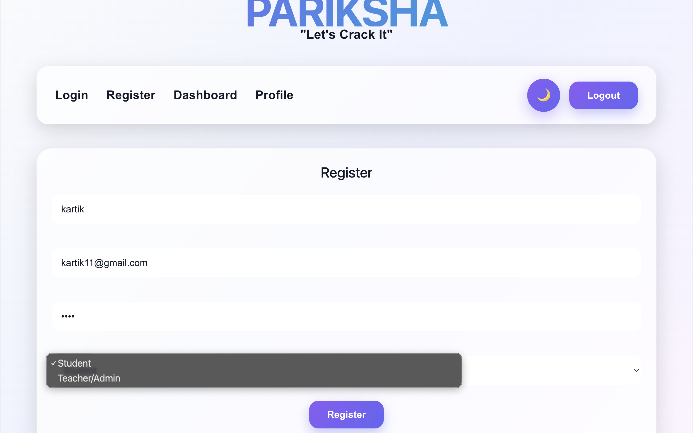

---

## 🎓 Student Dashboard

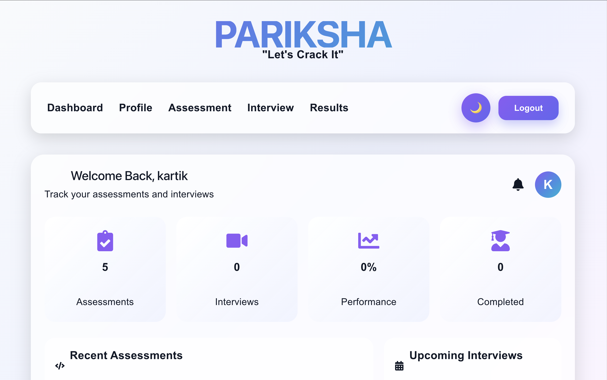

---

## 📚 Assessment Section

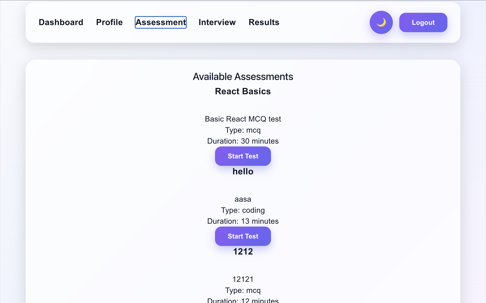

---

## ⏱️ Live Assessment

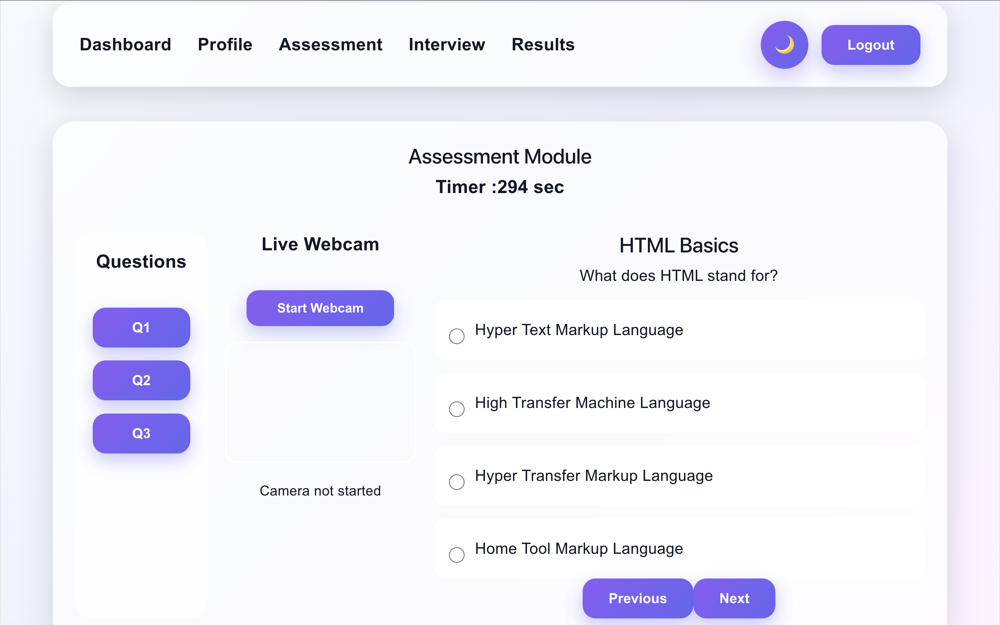

---

## 🎥 Student Interview Page

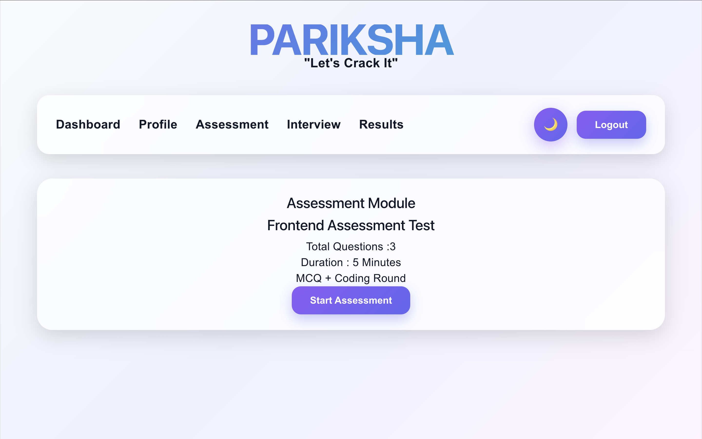

---

## 👤 Student Profile

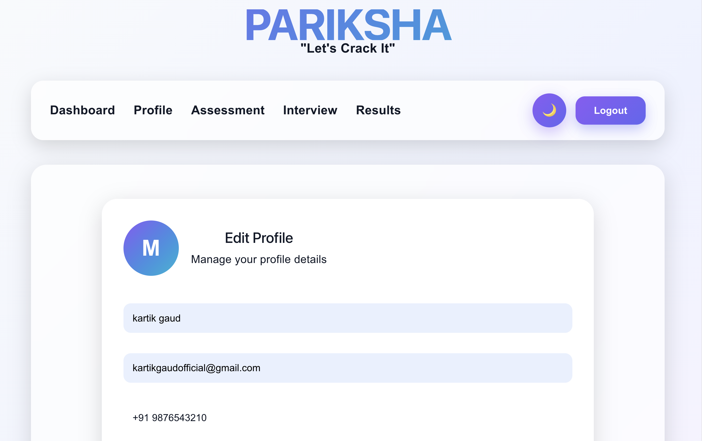

---

## 👤 Student Profile (Additional View)

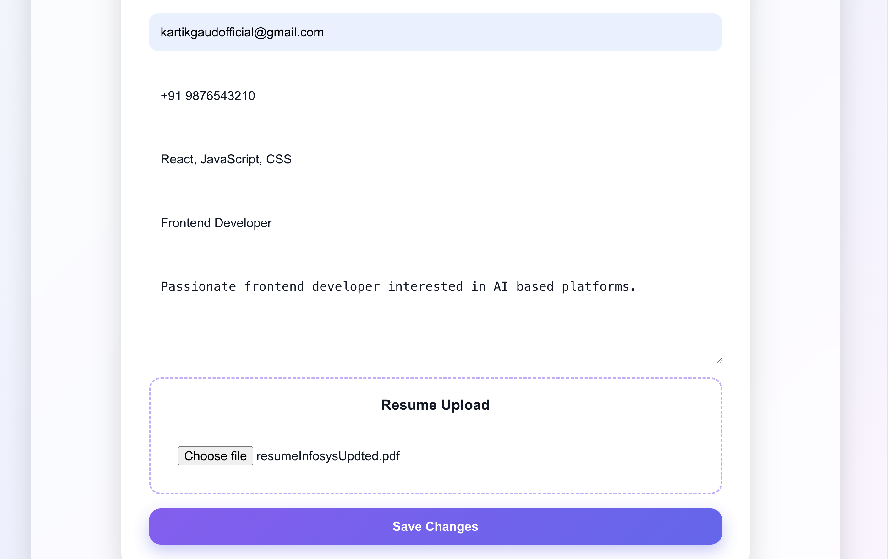

---

## 📅 Student Interview Schedule

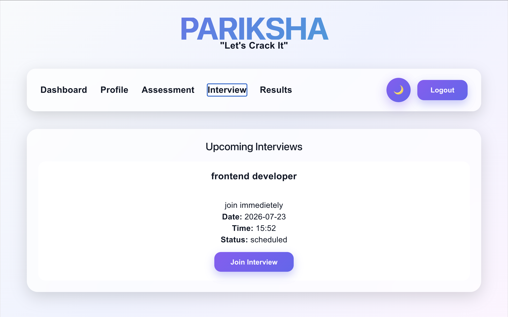

---

## 🛠️ Admin Dashboard

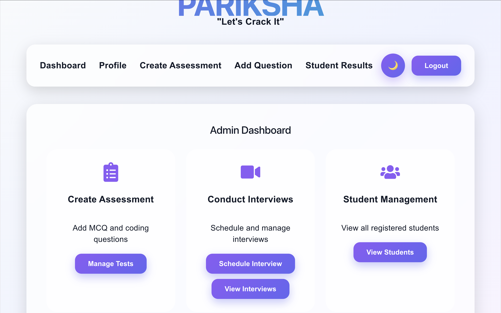

---

## ➕ Create Assessment

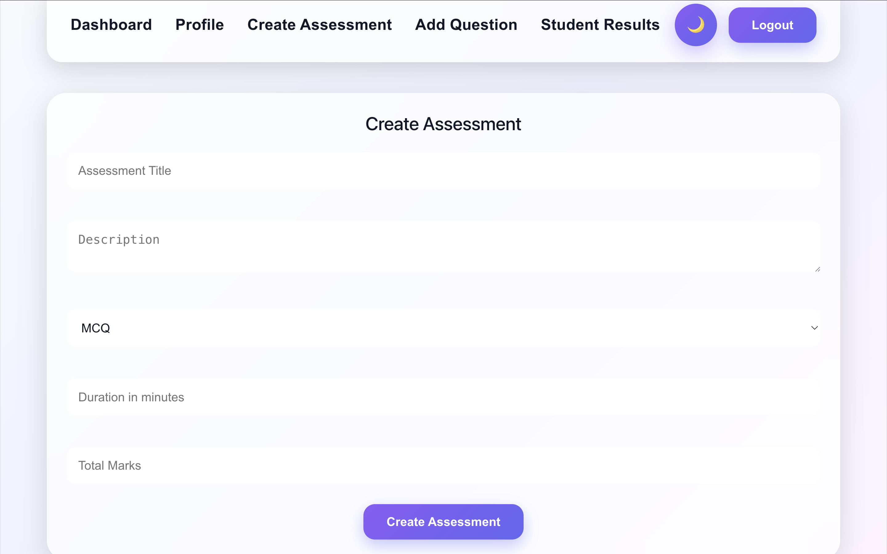

---

## 📅 Schedule Interview

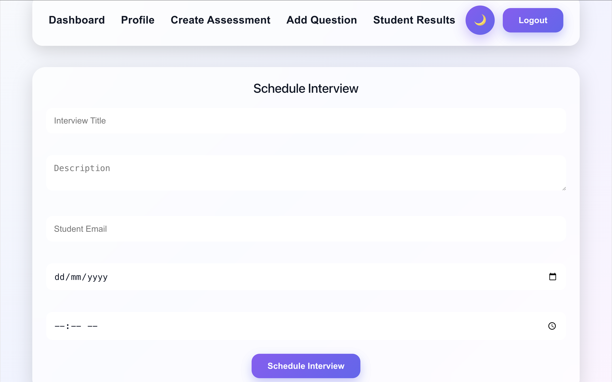

---

## 📅 Schedule Interview (Detailed View)

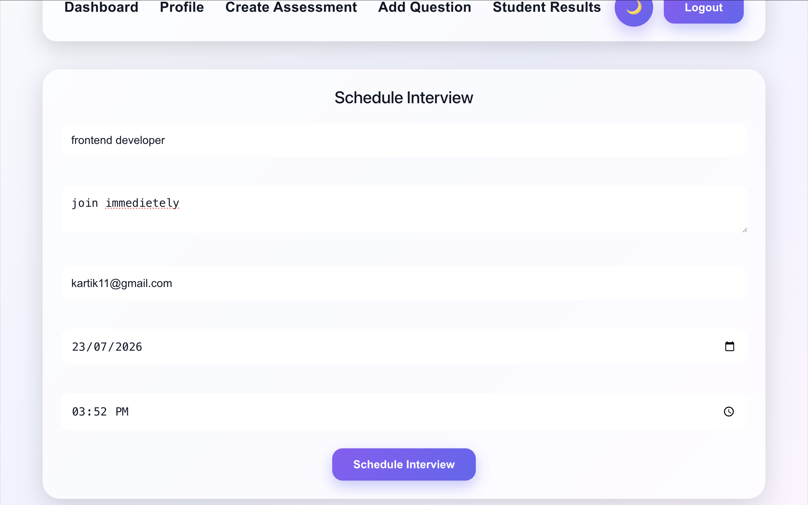

---

## 👨‍🎓 Candidate Interview Schedule

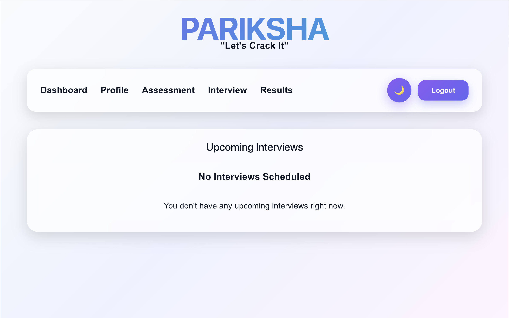

---

## 💬 Schedule Interview Popup

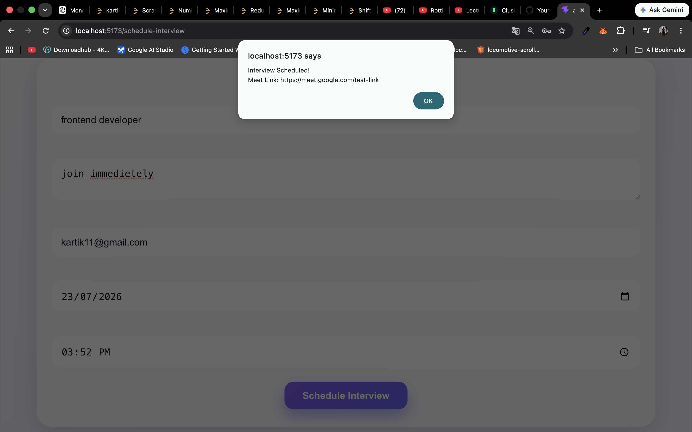

---

## 📊 Results Section

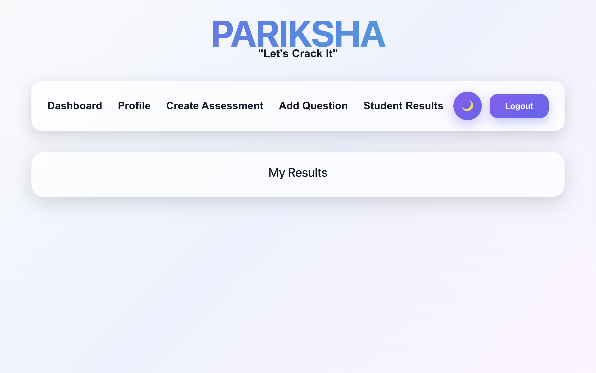

---

## 💬 Live Chat & Cheating Detection

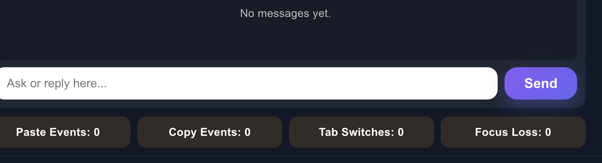

---

# 🏗️ System Architecture

```
                React.js + Vite
                       │
                 React Router DOM
                       │
                     Axios
                       │
                Express.js REST APIs
                       │
      JWT Authentication & Authorization
                       │
         Socket.io + WebRTC Signaling
                       │
                    MongoDB
```

---

# ⚙️ Features

## 🔐 Authentication

- User Registration
- Secure Login
- JWT Authentication
- Protected Routes
- Role-Based Authorization

---

## 📝 Assessment Module

- Create Assessments
- Manage Questions
- Start Assessment
- Automatic Score Calculation
- Result Generation

---

## 🎥 Interview Module

- Schedule Technical Interviews
- Candidate Tracking
- Interview Dashboard
- Real-Time Video Interviews

---

## 💻 Live Coding

- Coding Interface
- Technical Assessment
- Real-Time Coding Round
- Code Submission

---

## 📊 Dashboard

- Student Dashboard
- Admin Dashboard
- Performance Analytics
- Recent Activities
- Upcoming Interviews

---

## 💬 Real-Time Communication

- Socket.io Integration
- WebRTC Video Calling
- Live Chat
- Real-Time Updates

---

# 🛠 Tech Stack

## Frontend

- React.js
- Vite
- React Router DOM
- Axios
- CSS

## Backend

- Node.js
- Express.js
- MongoDB
- Mongoose
- JWT
- bcrypt.js
- Socket.io
- WebRTC

---

# 📂 Project Structure

```text
src/
│
├── assets/
├── components/
├── context/
├── pages/
├── routes/
├── services/
├── utils/
├── App.jsx
└── main.jsx
```

---

# 🚀 Installation

## Clone Repository

```bash
git clone https://github.com/kartik100-svg/pariksha-main.git
```

Move into the project directory

```bash
cd pariksha-main
```

Install dependencies

```bash
npm install
```

Run development server

```bash
npm run dev
```

Frontend runs at

```
http://localhost:5173
```

---

# 🔗 Backend Repository

👉 https://github.com/kartik100-svg/pariksha-backend

---

# 🚀 Future Enhancements

- 🤖 AI Interview Feedback
- 📄 Resume Parser
- 🤖 AI Question Generation
- 🛡️ AI-Based Proctoring
- 📧 Email Notifications
- 🌐 Multi-Language Coding Support
- 📜 Certificate Generation
- 📊 Advanced Analytics

---

# 👨‍💻 Author

**Kartik Gaud**

- GitHub: https://github.com/kartik100-svg
- LinkedIn: https://linkedin.com/in/kartik-gaud

---

⭐ If you found this project useful, consider giving it a **star** on GitHub.